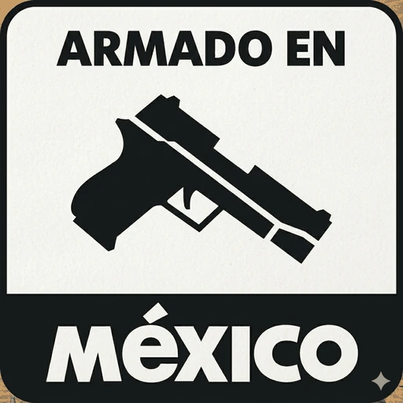
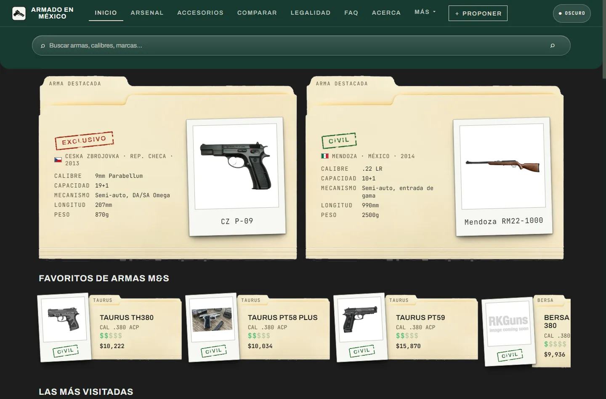
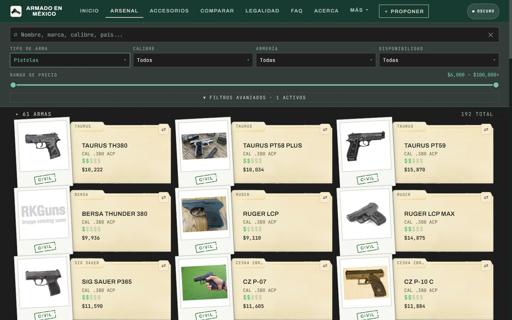
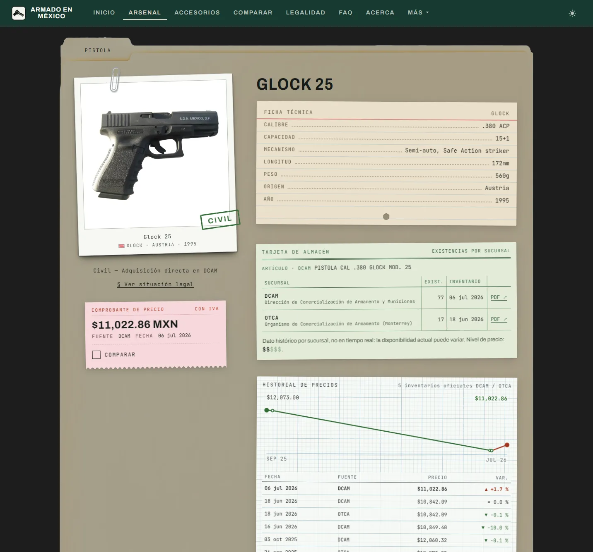
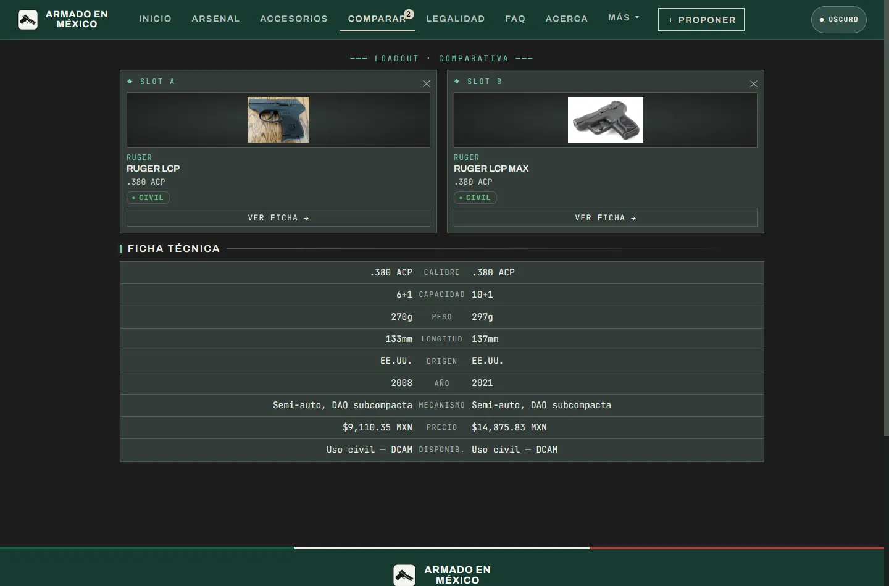
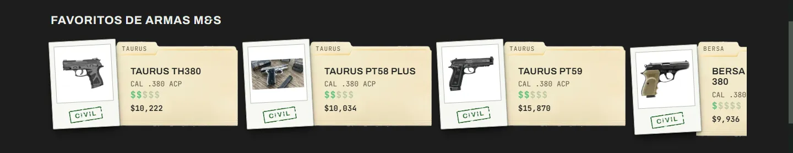
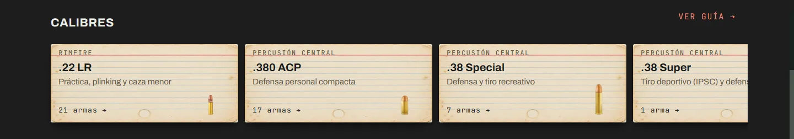
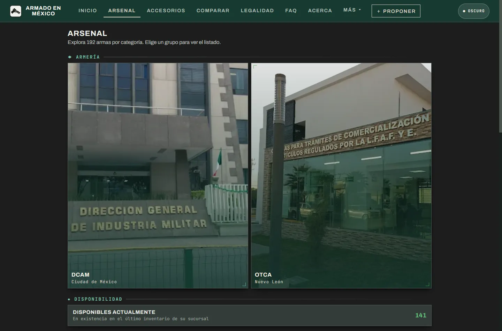
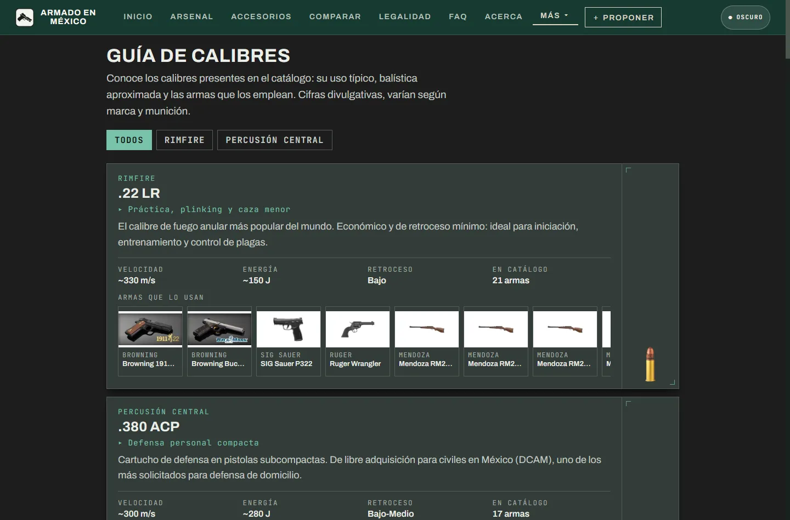

<div align="center">
  
  <p><strong>Enciclopedia divulgativa de armas legales en México</strong><br>Inventario oficial DCAM · SEDENA, por Armas M&amp;S</p>
  <p><a href="https://armado.mx"><strong>armado.mx</strong></a></p>
</div>

<!-- cifras:inicio -->
Catálogo actual: **192 armas · 36 accesorios · 71 municiones**,
servidas como **321 páginas HTML prerenderizadas** para que los buscadores y los
bots de IA —que no ejecutan JavaScript— vean el contenido real. El sitemap declara
**317 URLs**, 310 de ellas con la fecha real de su inventario (la última, 2026-07-06).

<sub>Bloque generado por `npm run cifras` desde el propio build. No editar a mano.</sub>
<!-- cifras:fin -->

|  |  |
|---|---|
| <br>**Portada** — las armas destacadas en su expediente y los favoritos de Armas M&S | <br>**Arsenal** — filtros por tipo, calibre, uso y disponibilidad |
| <br>**Ficha de arma** — clasificación legal y precio DCAM con historial | <br>**Comparador** — la Ruger LCP frente a la LCP MAX, fila por fila |

## Declaración de intenciones

Armado en México nace de la opacidad. Las instituciones no dan información pública y actualizada
sobre las armas que un ciudadano puede tener legalmente: desincentivan así el ejercicio de un
derecho constitucional —el del artículo 10, a la posesión legal de armas para proteger el
domicilio— y satanizan las armas en un país asolado desde hace más de veinte años por la
violencia y el narcotráfico.

Frente a eso, transparencia. Cada arma se muestra con fines informativos, y cada precio se publica
con el inventario oficial del que sale y su fecha, para que quien se lo plantee decida informado.

No creemos que cualquiera deba tener un arma. Defendemos el derecho que tenemos como mexicanos y
como personas a proteger nuestra vida, nuestra familia y nuestro hogar en un entorno donde la
violencia y el crimen son el pan de cada día, y donde alguien puede irrumpir en tu casa sin que las
autoridades respondan a tiempo.

Abogamos por la tenencia responsable de armas: para el tiro deportivo, pero sobre todo para la
capacitación y la protección del hogar.

*Armado en México · ¡Protege lo que amas!*

## Qué hace

### Portada: Favoritos de Armas M&S y calibres



**Favoritos de Armas M&S** es una selección del equipo de Armas M&S: armas que nos gustan y que
creemos que vale la pena conocer. No es un ranking ni depende de las visitas —para eso está «Las
más visitadas», justo debajo—: la elegimos a mano desde el panel de administración. Cada tarjeta
abre la ficha del arma.



**Calibres** es la puerta corta a la guía. Cada ficha resume un calibre: su sistema (Rimfire o
Percusión central), su uso típico —«Defensa personal compacta», «Práctica, plinking y caza
menor»— y cuántas armas del catálogo lo usan, con el cartucho dibujado a escala: su altura es
proporcional a la longitud real del cartucho, con la misma escala en todas, así que se comparan
de un vistazo. Sirven para orientarse antes de mirar armas: para qué es cada calibre y cuánta
oferta tiene. Tocar una ficha, o «Ver guía →», abre la Guía de calibres.

### Arsenal



El Arsenal no abre con una lista: abre con una página que reparte el catálogo según la pregunta
con la que llega cada quien. Todos los grupos abren el listado ya filtrado, y los que llevan
contador dicen cuántas armas reúnen:

- **Armería.** Las dos armerías cuyos inventarios oficiales concilia el sitio: la **DCAM**, en la
  Ciudad de México, y la **OTCA**, en Nuevo León. Cada una publica su propio inventario, y al
  elegir una aparecen las armas que han figurado en los de esa sede: sirve para saber qué ha
  ofrecido la que te queda cerca.
- **Disponibilidad.** «Disponibles actualmente» junta las armas con existencias en el último
  inventario de su armería. Es el atajo para empezar por lo que había en existencia; ese dato es
  el del inventario, no un stock en tiempo real, y la ficha lo advierte.
- **Clasificación legal.** Uso civil, Policía / Seguridad y Exclusivo Ejército, cada una con su
  descripción y su contador.
- **Tipo de arma, uso y calibre.** Pistolas, revólveres, rifles, escopetas y carabinas; tiro
  deportivo, cacería y defensa del hogar; y un acceso por cada calibre que tiene armas en el
  catálogo.
- **Ver todas las armas**, al final, abre el listado completo.

Todas esas entradas llevan al mismo listado —el de la segunda captura de arriba—, con su filtro
ya puesto y el resto a mano para seguir afinando:

- **Buscador**: nombre, marca, calibre o país.
- **Tipo de arma**, **Calibre**, **Armería** (DCAM · Ciudad de México u OTCA · Nuevo León) y
  **Disponibilidad** (con existencias o agotadas).
- **Rango de precio**: una barra con mínimo y máximo. Sus límites se recalculan con los demás
  filtros para abarcar solo las armas que quedan, y con el tirador al tope entra también todo lo
  que pasa de $100,000.
- **Filtros avanzados**: uso, clasificación legal, marca, mecanismo (Semi-auto, Cerrojo, Bombeo,
  Revólver o Sobrepuesta) y era (Clásico, antes de 1990; Moderno, de 1990 a 2014; Vanguardia, de
  2015 en adelante).

Sobre las tarjetas se lee cuántas armas quedan frente al total, y la ✕ del buscador quita todos
los filtros de una vez. Cada tarjeta es un expediente con la marca, el nombre, el calibre, el
nivel de precio (de $, menos de $10,000, a $$$$$, desde $100,000) y el precio de referencia, con
el sello de su clasificación legal al pie de la foto. Su botón ⇄ la añade al comparador.

### Ficha de arma

Cada arma tiene su página (la tercera captura de arriba), ordenada según las preguntas de quien
la está considerando:

- **El expediente.** Todo va dentro de un folder manila abierto, con su tipo rotulado en la
  pestaña. A la izquierda, la foto en una copia instantánea sujeta con un clip, con marca, país
  —con su bandera— y año anotados al pie y el **sello de su clasificación legal** estampado encima;
  debajo, la situación legal en una línea y el **comprobante de precio**: la cifra con IVA, la
  armería que la publicó, la fecha de su inventario y la casilla **Comparar**. En escritorio esa
  columna se queda fija mientras se leen los documentos de la derecha; en el teléfono el
  comprobante vuelve a aparecer abajo en cuanto sale de la pantalla.
- **Ficha técnica**, mecanografiada en una ficha de fichero: calibre, capacidad, mecanismo,
  longitud, peso, origen y año.
- **Tarjeta de almacén.** Las existencias por sede: cuántas piezas marcó el último inventario de la
  DCAM y el de la OTCA, o AGOTADO si el arma ya no aparece en él, con la descripción literal con la
  que figura en el inventario, el enlace a cada PDF y el aviso de que es un dato histórico.
- **Historial de precios**, en papel milimétrico. Cada inventario oficial en el que aparece el arma
  deja un punto: la gráfica enseña cómo se ha movido el precio y el registro lista cada inventario
  con su fecha, su armería, su precio y cuánto cambió respecto al anterior. Los PDFs oficiales van
  grapados al pie como anexos. Con un solo inventario sale solo su registro.
- **Legalidad, Usos y Antecedentes**, en los separadores de una hoja de oficio: la clasificación
  con dónde se consigue y un enlace a la guía legal, los usos del arma y su historia.
- **Munición y accesorios compatibles**, en una vitrina: los cartuchos del inventario de su mismo
  calibre y los accesorios que le corresponden, cada uno con su etiqueta de precio y su ficha.
- **Para cerrar**, el video del modelo cuando lo hay; la tarjeta de «¿Recomiendas esta arma?», un
  sí o no con reseña escrita que solo se publica después de moderarla, y armas similares del
  mismo tipo.

### Comparador

Pone dos armas lado a lado y las lee fila por fila: **calibre, capacidad, peso, longitud, origen,
año, mecanismo, precio de referencia y disponibilidad**. Se llena con el botón ⇄ de cualquier
tarjeta o con **⇄ Comparar** en la ficha; COMPARAR, en la barra de navegación, lleva la cuenta, y
si se añade una tercera arma sale la primera que entró. Cada lado tiene «Ver ficha →» y una ✕
para quitarla, y un hueco libre deja elegir otra desde el listado.

Sirve para decidir entre candidatas con datos y no con fotos. El calibre dice qué munición
necesita; capacidad, peso y longitud, cuánto carga y cuánto abulta; el año separa diseños
recientes de clásicos; el precio es el de referencia del inventario oficial, y la disponibilidad
dice a quién se destina según su clasificación legal.

La captura enseña el caso típico. La **Ruger LCP** y la **Ruger LCP MAX** parecen la misma pistola
en dos versiones: misma marca, mismo calibre, mismo mecanismo, mismo origen y las dos de uso
civil. Fila por fila, la diferencia salta:

|  | Ruger LCP | Ruger LCP MAX | Diferencia |
|---|---|---|---|
| Capacidad | 6+1 | 10+1 | 4 cartuchos más en el cargador |
| Peso | 270g | 297g | +27 g |
| Longitud | 133mm | 137mm | +4 mm |
| Año | 2008 | 2021 | 13 años después |
| Precio | $9,110.35 MXN | $14,875.83 MXN | +$5,765.48, un 63 % más |

La MAX es la evolución de la LCP: casi del mismo tamaño y peso, lleva cuatro cartuchos más y
cuesta un 63 % más. Si esos cuatro cartuchos valen la diferencia lo decide cada quien, pero con
los números delante: eso es lo que una foto no enseña y el comparador sí.

<sub>Precios de referencia del último inventario oficial de cada arma, tal como los mostraba el
comparador el 11 de septiembre de 2026. Cambian con cada inventario nuevo.</sub>

### Guía de calibres



Una ficha por calibre, desde el menú MÁS o desde la portada. Cada una da su sistema y su uso
típico, una descripción, la balística aproximada —velocidad y energía—, el retroceso y cuántas
armas del catálogo lo usan; debajo, esas armas en una tira que se arrastra, y cada una abre su
ficha. A un lado va el cartucho, con la misma escala en todas las fichas. Arriba, un filtro separa
Rimfire de Percusión central.

Sirve para elegir el calibre antes que el arma: qué se usa para defensa, qué para tiro deportivo o
caza, cuánto retroceso tiene y cuántas opciones hay en el catálogo. Las cifras son divulgativas y
varían según marca y munición, y la guía lo advierte.

### Y además

- **Municiones y accesorios** del inventario oficial, con marca, compatibilidad y precio.
- **Tenencia legal** — requisitos y pasos del trámite ante la SEDENA conforme a la Ley Federal
  de Armas de Fuego y Explosivos, y **preguntas frecuentes** sobre licencias y portación.
- **Armas traumáticas** — defensa menos letal por CO₂, que no son armas de fuego y no piden
  permiso; la duda más repetida del público.
- **Prerender.** La app pinta con JavaScript, y hasta las 321 páginas el sitio era invisible
  para quien no lo ejecuta: Googlebot no renderiza JS en respuestas 4xx y los crawlers de IA
  (GPTBot, ClaudeBot, PerplexityBot) no lo ejecutan nunca. El build emite un `.html` real por
  URL, con su `<title>`, canonical, Open Graph y JSON-LD. El porqué, con fuentes, en
  [`docs/SEO.md`](docs/SEO.md).

Es un catálogo **divulgativo**: aquí no se compran ni se venden armas.

## Cómo funciona

App estática de React **sin bundler**. Los archivos no son módulos ES: se comunican por
`window.*` y el orden de los `<script>` importa. Babel solo precompila los `.jsx` a
`.js`.

La fuente vive en `src/` y `public/`; el build la deja en `out/`, que es lo que se
publica. **Las rutas servidas son planas**: `src/styles/estilo.css` acaba en
`out/estilo.css` y se sirve como `/estilo.css`.

```
public/       imagenes/ · inventarios/ · _headers · logo.png · manifest.webmanifest
src/          app.jsx · admin.jsx
  pages/      index.html · admin.html · 404.html
  screens/    pantallas (home, catálogo, ficha, comparador, municiones…)
  components/ ui.jsx
  data/       catálogo y precios (data-*.js)
  lib/        store.js (persistencia) · dev-viewport.js (barra DEBUG)
  styles/     estilo.css
scripts/      build-prerender.mjs · copiar-estaticos.mjs · actualizar-readme.mjs · sql/schema.sql
functions/    Cloudflare Pages Functions (API)
docs/         documentación técnica · capturas/
out/          generado por el build — no se commitea
```

## Desarrollo local

```bash
npm install
npm run build     # build:static → build:js → build:html
npx serve out
```

`npm run watch` recompila los `.jsx` al guardar.

`npm run cifras` reescribe el bloque de cifras de este README a partir de
`out/cifras.json`, que emite el prerender. **No va dentro de `build`** a propósito: un
build no debe modificar ficheros fuente. En `main` lo corre solo
[el workflow](.github/workflows/cifras-readme.yml) cuando cambian los datos.

## Despliegue

Lo sirve **Cloudflare Pages** desde `out/` (`pages_build_output_dir` en
`wrangler.toml`), con build `npm ci && npm run build`. GitHub Pages sigue configurado
pero solo redirige a armado.mx.

Los datos curados viven en `localStorage` por navegador y, cuando el backend está
aprovisionado (**Pages Functions + D1**), se replican al servidor para que todos los
visitantes vean lo mismo. La app funciona igual sin backend, en modo offline con seeds.
Detalle en [`docs/BACKEND.md`](docs/BACKEND.md).

## Documentación

| Documento | Contenido |
|---|---|
| [`AGENTS.md`](AGENTS.md) | Guía completa: estructura, build, deploy, trampas ya pagadas |
| [`docs/DESIGN.md`](docs/DESIGN.md) | Brief de diseño vigente y dirección de arte |
| [`docs/BACKEND.md`](docs/BACKEND.md) | Backend D1, alta y sondas de verificación |
| [`docs/SEO.md`](docs/SEO.md) | Por qué existe el prerender, con fuentes |
| [`docs/PRODUCT.md`](docs/PRODUCT.md) | Alcance y decisiones de producto |
| [`docs/PLACEHOLDERS.md`](docs/PLACEHOLDERS.md) | Secciones congeladas y cómo reactivarlas |

## Identidad y paleta

La identidad de Armado en México sale de donde sale su catálogo: del papeleo real de la DCAM.
En el arsenal, cada arma es un expediente —folder manila, copia instantánea y un sello de tinta
que la clasifica como CIVIL, SEGURIDAD o EXCLUSIVO—. Las categorías de la portada son cartas de
lotería, y las municiones esperan en un puesto con letrero de mercado. Lo mexicano está en esas
cosas que cualquiera reconoce, no en símbolos oficiales: el sitio no usa escudo, águila ni
emblemas de ninguna institución. Es la gráfica de todos los días en México, tomada en serio.

| Color | Token | Hex | Dónde |
|---|---|---|---|
| Verde de marca | `--marca` | `#173A32` | la banda superior y la navegación, igual en los dos temas |
| Crema | `--crema` | `#F3EFE4` | la tinta clara sobre el verde |
| Lienzo | `--lienzo` · `--d-lienzo` | `#E7EAE4` · `#1D1D1D` | el fondo, en tema claro y oscuro |
| Tinta | `--negro` | `#171B19` | lo mecanografiado |
| Folder manila | `--carton-alto` · `--carton-filo` | `#F6EACF` · `#D8C69B` | la pestaña y el canto; el cuerpo lo pone la foto de un folder real |
| Copia instantánea | `--copia-carton` | `#F7F8F4` | el marco de la foto del arma |
| Sello CIVIL | `--sello-civil` | `#2F6B33` | la tinta de las armas civiles |
| Sello SEGURIDAD y EXCLUSIVO | `--sello-restr` | `#A3341F` | la tinta de las restringidas |
| Lámina de lotería | `--loteria-lamina` | `#EFC01F` | las cartas de categoría de la portada |
| Mesa del puesto | `--mesa-tabla` | `#C09A72` | la madera del puesto de municiones |

Los valores salen de [`src/styles/estilo.css`](src/styles/estilo.css) y el criterio, de
[`docs/DESIGN.md`](docs/DESIGN.md). Los colores de los objetos no tienen variante oscura a
propósito: una carta de lotería es amarilla con la luz encendida o apagada.
