

  <a href="https://armado.mx">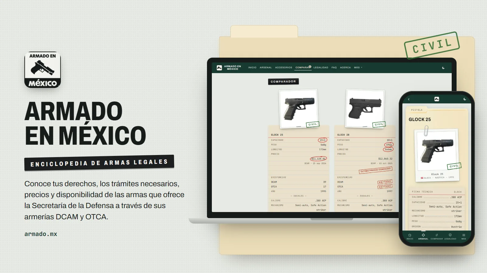</a>
  
<strong>Enciclopedia divulgativa de armas legales en México</strong> Inventario oficial DCAM y OTCA · por Armas M&amp;S

  
<a href="https://armado.mx"><strong>armado.mx</strong></a> · <a href="#ficha-de-arma">Qué hace</a> ·  · <a href="#licencia">Licencia</a>

## ¿Qué es Armado en México?

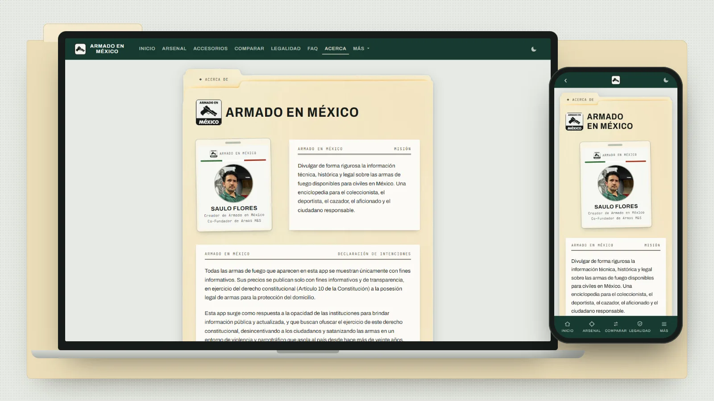

Armado en México es un proyecto divulgativo de código abierto que busca dar transparencia y
empoderar a los ciudadanos a través del conocimiento de la ley, los procesos administrativos, los
requisitos y costos que se necesitan para hacer los trámites ante la Secretaría de la Defensa para
ejercer el derecho constitucional de poseer armas en el domicilio para la protección del mismo.

Armado en México no pertenece ni representa a ningún partido político o entidad gubernamental. No
emitimos permisos, no comercializamos ni distribuimos ningún artículo de los presentados por la
DCAM y OTCA; estas armerías son las únicas oficiales donde realizar su trámite. Somos ciudadanos
que buscan democratizar estos procesos y combatir los estigmas sociales que satanizan a quienes
buscan poder protegerse en el entorno de violencia e inseguridad que asola el país.

## Ficha de arma

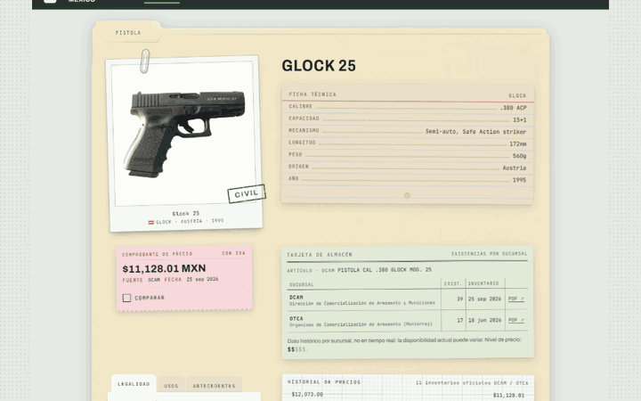

Cada arma tiene su página, y toda va dentro de un folder manila, ordenada según las preguntas de
quien la está considerando:

- **Precio oficial con IVA.** El comprobante dice la cifra, la armería que la publicó y la fecha
  de su inventario. Si el arma ya no aparece en el inventario más reciente, lleva el sello
  **ÚLTIMO PRECIO CONOCIDO**. La casilla **Comparar** la manda al comparador.
- **Existencias por armería.** La tarjeta de almacén da cuántas piezas marcó el último inventario
  de la DCAM y el de la OTCA —o AGOTADO—, con la descripción literal del inventario y el enlace al
  PDF oficial. Es un dato histórico, no un stock en tiempo real, y la ficha lo advierte.
- **Calibre y ficha técnica.** Calibre, capacidad, mecanismo, longitud, peso, origen y año,
  mecanografiados en una ficha de fichero.
- **Clasificación legal.** El sello de la foto —CIVIL, SEGURIDAD o EXCLUSIVO— y la hoja de oficio
  que explica qué permiso hace falta, dónde se consigue y un enlace a la guía legal. Sus
  separadores guardan también los usos del arma y su historia.
- **Historial de precios.** Cada inventario oficial en el que aparece el arma deja un punto en el
  papel milimétrico; el registro lista cada inventario con su fecha, su armería, su precio y
  cuánto cambió respecto al anterior.

Más abajo esperan la **munición y los accesorios compatibles**, en una vitrina, la tarjeta de
[recomendaciones](#sistema-de-recomendaciones) y las armas similares.

## Ficha de munición y de accesorio

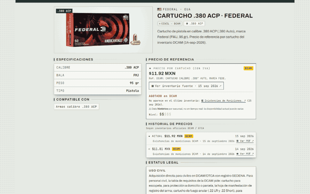

Cada caja de munición del inventario oficial tiene su ficha: marca, calibre, tipo de bala y peso
en granos, el **precio de referencia por cartucho** con la fuente de la que sale, las existencias
por armería, su historial de precios y su estatus legal. Desde la ficha se salta a todas las armas
de ese calibre.

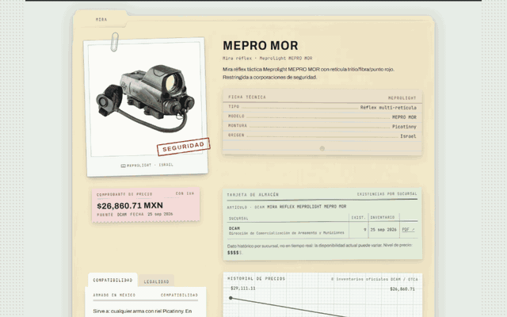

Los accesorios —cargadores, ópticas, empuñaduras y demás— siguen la misma lógica que las armas:
foto con su sello de clasificación, ficha técnica, comprobante de precio y tarjeta de almacén.
Cada uno dice con qué armas es compatible, y cada arma lista los suyos.

## Comparación de armas

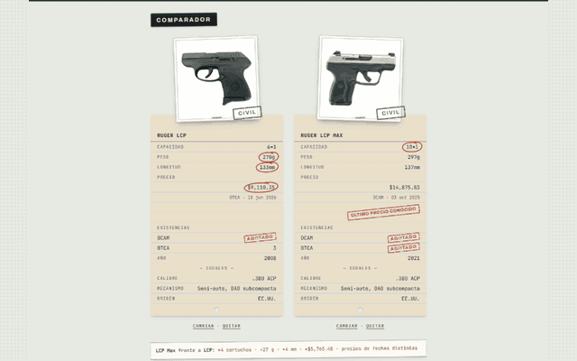

Pone dos armas lado a lado y las lee fila por fila: **capacidad, peso, longitud, precio,
existencias, año, calibre, mecanismo y origen**. Arriba van las filas que las distinguen, con la
mejor cifra rodeada en rojo; abajo, bajo «IGUALES», lo que comparten. Se llena con el botón ⇄
de cualquier tarjeta o con la casilla **Comparar** de la ficha; si se añade una tercera arma sale
la primera que entró, y cada comparación tiene su propia URL para compartirla.

Sirve para decidir entre candidatas con datos y no con fotos. El recorrido enseña el caso típico: la
**Ruger LCP** y la **Ruger LCP MAX** parecen la misma pistola en dos versiones —misma marca,
calibre, mecanismo y origen, las dos de uso civil—, pero fila por fila la diferencia salta.

## Apartado legal

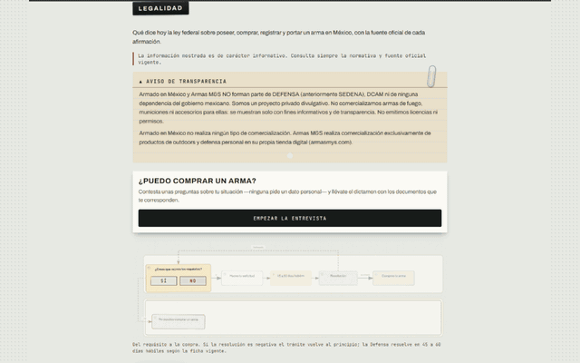

Una sola página, con la entrevista arriba, el mapa del trámite y cuatro folders desplegables, y
**toda afirmación trae su fuente oficial y la fecha en que se consultó**:

- **Federal**, ordenado por la pregunta que traes: qué arma puedes tener, qué papel llenas, cuánto
  cuesta.
- **Estatal**: lo que de verdad cambia por estado. Lo que no está verificado **se declara** en vez
  de rellenarse: las entidades sin portal de antecedentes penales comprobado lo dicen junto a su
  nombre.
- **Trámites**: seis trámites ante la Defensa, cada uno con lo que habilita, su checklist y su
  cuota vigente. El permiso extraordinario ante el Registro Federal de Armas y la compra en la DCAM
  son **dos trámites que se confunden**, y creer que son el mismo es lo que hace que alguien llegue
  al mostrador sin expediente.
- **Documentos**: los formatos y leyes oficiales en PDF.

Escrita sobre la Ley Federal de Armas de Fuego y Explosivos **reformada el 29 de mayo de 2025**.

## Entrevista de documentos

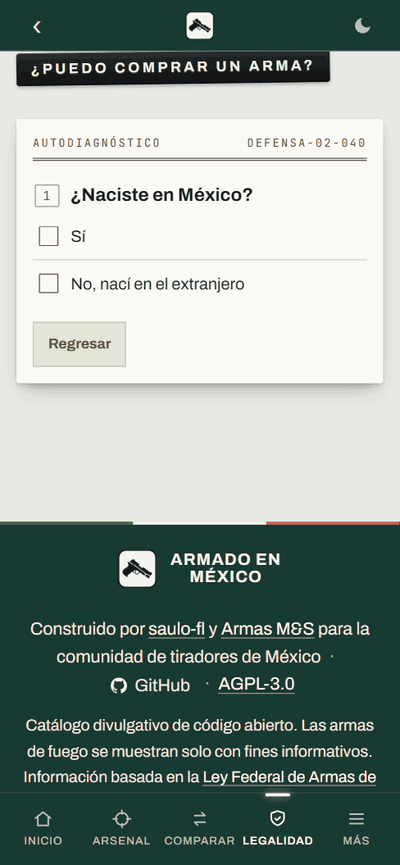

**«¿Puedo comprar un arma?»** es un autodiagnóstico: preguntas sobre tu situación —ninguna pide
un dato personal, todas las respuestas son categorías— y, con cada respuesta, el documento que te
toca cae sobre la mesa: acta de nacimiento, CURP, identificación, cartilla, comprobante de
ingresos, constancia de antecedentes, comprobante de domicilio, certificado médico-psicológico.

Distingue los escenarios que el formato distingue y casi nadie cuenta —asalariado, independiente,
pensionado, ejidatario, comunero, jornalero, coleccionista, socio de club y militar— y al final da
el dictamen con la lista de documentos que te corresponden, que se puede guardar como imagen.
Cuando algo no procede lo dice sin rodeos y sin ofrecer un remedio que no existe. Y cuando reúnes
todo, tampoco promete nada: la autorización la decide la autoridad, no un cuestionario.

## Guía de calibres

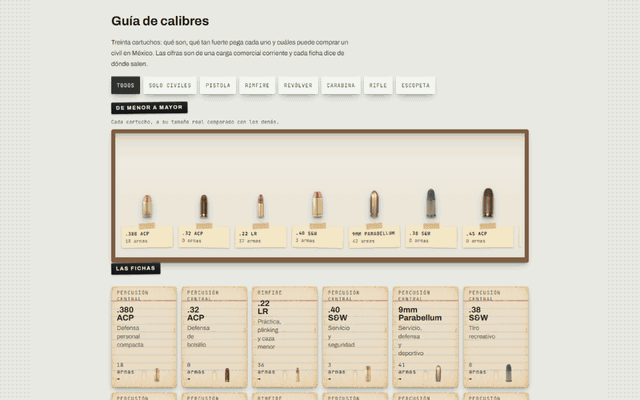

Treinta cartuchos: qué son, qué tan fuerte pega cada uno y cuáles puede comprar un civil en
México. La vitrina los pone **a su tamaño real, de menor a mayor**, y un filtro separa los de uso
civil, por tipo de arma y Rimfire de percusión central. Cada calibre tiene su ficha: sistema, uso
típico, velocidad y energía aproximadas, retroceso, su clasificación legal y cuántas armas del
catálogo lo usan, con esas armas a un toque.

Sirve para elegir el calibre antes que el arma. Las cifras son divulgativas —de una carga
comercial corriente— y cada ficha dice de dónde salen.

## Arsenal por sucursal y por disponibilidad

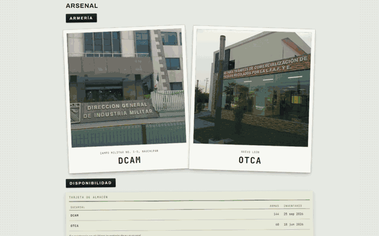

El Arsenal no abre con una lista: abre repartiendo el catálogo según la pregunta con la que llega
cada quien.

- **Por armería.** Las dos sedes cuyos inventarios oficiales concilia el sitio: la **DCAM**, en el
  Campo Militar 1-D de Naucalpan, y la **OTCA**, en Nuevo León. Al elegir una aparecen las armas
  que han figurado en sus inventarios: sirve para saber qué ha ofrecido la que te queda cerca.
- **Por disponibilidad.** Una tarjeta de almacén cuenta cuántas armas tenía en existencia cada
  sucursal en su último inventario, y lleva directo a ellas.
- **Por clasificación legal, tipo de arma, uso y calibre**, cada entrada con su contador.

Todas llevan al mismo listado, con su filtro ya puesto y el resto a mano para seguir afinando:
buscador, tipo, calibre, armería, disponibilidad, rango de precio, uso, marca, mecanismo y era.

## Colaborar con reportes

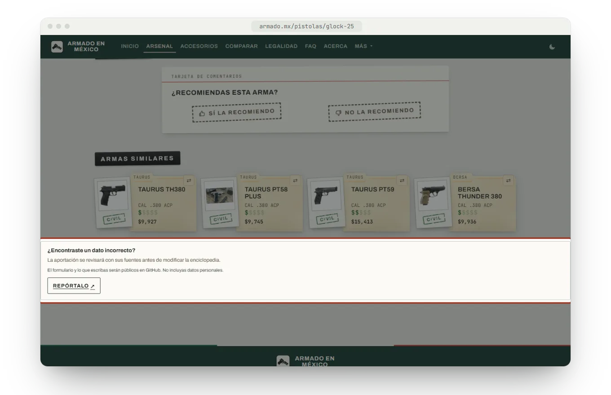

La enciclopedia se corrige con ayuda de quien la usa. Al pie de cada ficha de arma, munición,
accesorio y calibre, y de las páginas de Legalidad y Preguntas frecuentes, está el aviso
**¿Encontraste un dato incorrecto?** Su botón **Repórtalo** abre el
[formulario público de corrección](https://github.com/saulo-fl/armado-en-mexico/issues/new?template=correccion.yml)
en GitHub con la página, el tipo de contenido y el nombre de la ficha ya puestos. Pide:

1. La página exacta y el tipo de contenido.
2. El dato actual, tal como aparece.
3. La corrección propuesta y por qué.
4. Las fuentes: DOF, Cámara de Diputados, DEFENSA, inventarios DCAM/OTCA, el fabricante o un
   manual oficial.

Cada aportación se revisa con sus fuentes antes de tocar la web. El formulario es público: no
incluyas datos personales. Si además quieres proponer el cambio en código, el proceso está en
[`CONTRIBUTING.md`](CONTRIBUTING.md).

## Sistema de recomendaciones

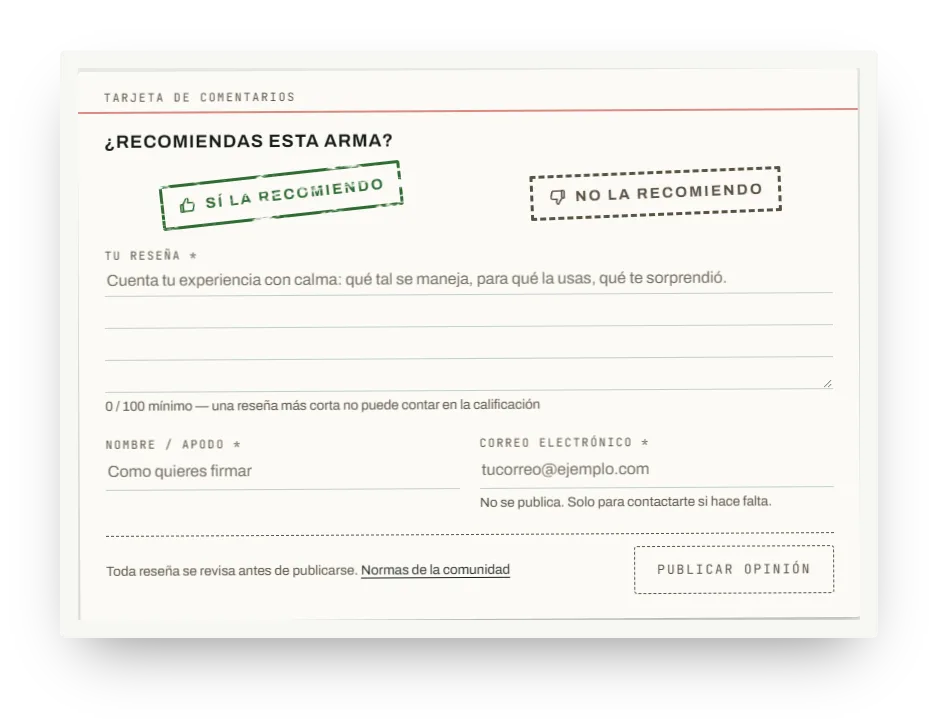

Sin estrellas: cada ficha pregunta **«¿Recomiendas esta arma?»** y se contesta con uno de dos
sellos, **Sí la recomiendo** o **No la recomiendo**. Un voto sin reseña no existe: al elegir sello
se abre el formulario, y la reseña pide al menos 100 caracteres, un nombre o apodo y un correo que
nunca se publica.

Nada sale al público sin moderación. Toda reseña entra en una cola privada, una persona del
equipo decide si cumple las [normas](#soporte-y-normas) y, al aprobarla, el correo se borra. Con
las aprobadas, la ficha resume el sentir de la comunidad —**Extremadamente positivas**,
**Mayormente positivas**, **Variadas**, **Mayormente negativas**— y deja leer cada opinión. La
misma tarjeta está en las fichas de munición y de accesorio.

## Soporte y normas

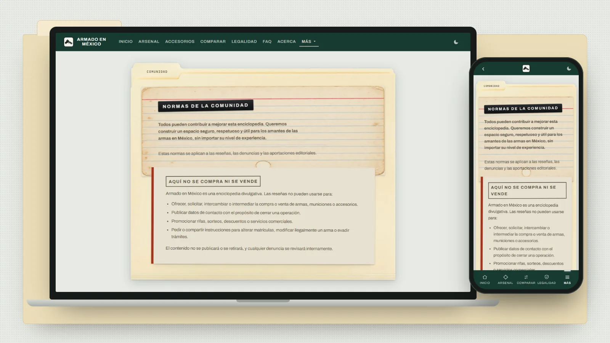

La página de Soporte reúne las **normas de la comunidad**, que rigen las reseñas, las denuncias y
las aportaciones:

- **Aquí no se compra ni se vende.** Nada de ofrecer, pedir o intermediar armas, municiones o
  accesorios, ni datos de contacto para cerrar una operación, ni instrucciones para alterar
  matrículas o evadir trámites.
- **Respeto y seguridad**: se debate el producto, no a las personas, y no se publican datos de
  terceros.
- **Experiencias útiles y pertinentes**: qué usaste, en qué contexto, qué funcionó y qué no. Una
  reseña no se retira solo por ser desfavorable.
- **Independencia**: fabricantes, tiendas, clubes y campos no reseñan lo que venden; sí pueden
  corregir datos por el formulario público declarando su relación.
- **Autenticidad**: nada de reseñas copiadas, pagadas o coordinadas.

Explica también **cómo se modera** —cola privada, revisión humana, las opiniones negativas
fundadas con el mismo trato que las positivas— y trae el formulario para **denunciar una reseña**,
de forma anónima si se quiere.

## Licencia

Armado en México es software libre y contenido abierto:

- El **código**, bajo la [**GNU Affero General Public License v3 o posterior**](LICENSE).
- [**Términos adicionales**](TERMINOS-ADICIONALES.md) de la sección 7 de esa licencia: el
  nombre, el logotipo y la identidad del proyecto.
- [**Licencia de contenido**](LICENCIA-CONTENIDO.md): qué se concede sobre el catálogo, los
  inventarios oficiales y las imágenes, pieza por pieza.
