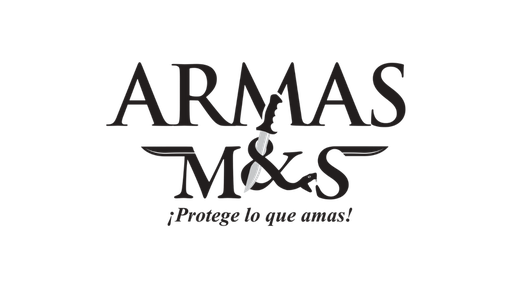

<div align="center">
  
  <p><strong>Enciclopedia divulgativa de armas legales en México</strong><br>Inventario oficial DCAM · SEDENA, por Armas M&amp;S</p>
  <p><a href="https://armado.mx"><strong>armado.mx</strong></a></p>
</div>

<!-- cifras:inicio -->
Catálogo actual: **192 armas · 36 accesorios · 71 municiones**,
servidas como **322 páginas HTML prerenderizadas** para que los buscadores y los
bots de IA —que no ejecutan JavaScript— vean el contenido real. El sitemap declara
**317 URLs**, 310 de ellas con la fecha real de su inventario (la última, 2026-07-06).

<sub>Bloque generado por `npm run cifras` desde el propio build. No editar a mano.</sub>
<!-- cifras:fin -->

|  |  |
|---|---|
| <br>**Portada** — las armas destacadas en su expediente y los favoritos de Armas M&S | <br>**Arsenal** — filtros por tipo, calibre, uso y disponibilidad |
| <br>**Ficha de arma** — clasificación legal y precio DCAM con historial | <br>**Comparador** — dos armas lado a lado, con su ficha técnica |

## Qué hace

- **Arsenal con filtros.** El catálogo completo en una pantalla, acotable por tipo, calibre,
  uso y disponibilidad, y cruzable con el buscador.
- **Una ficha por arma.** Datos técnicos, **clasificación legal** en México (qué se puede tener,
  qué se puede portar y con qué permiso) y el **precio de referencia DCAM con su historial**:
  cada inventario publicado deja su punto, así que se ve cómo se ha movido.
- **Comparador.** Dos armas lado a lado, campo por campo.
- **Municiones y accesorios** del inventario oficial, con marca, compatibilidad y precio.
- **Guía de calibres** — para qué sirve cada uno: uso típico, velocidad, energía y retroceso.
- **Tenencia legal** — requisitos y pasos del trámite ante la SEDENA conforme a la Ley Federal
  de Armas de Fuego y Explosivos, y **preguntas frecuentes** sobre licencias y portación.
- **Armas traumáticas** — defensa menos letal por CO₂, que no son armas de fuego y no piden
  permiso; la duda más repetida del público.
- **Prerender.** La app pinta con JavaScript, y hasta las 322 páginas el sitio era invisible
  para quien no lo ejecuta: Googlebot no renderiza JS en respuestas 4xx y los crawlers de IA
  (GPTBot, ClaudeBot, PerplexityBot) no lo ejecutan nunca. El build emite un `.html` real por
  URL, con su `<title>`, canonical, Open Graph y JSON-LD. El porqué, con fuentes, en
  [`docs/SEO.md`](docs/SEO.md).

Es un catálogo **divulgativo**: aquí no se compran ni se venden armas.

## Cómo funciona

App estática de React **sin bundler**. Los archivos no son módulos ES: se comunican por
`window.*` y el orden de los `<script>` importa. Babel solo precompila los `.jsx` a
`.js`.

La fuente vive en `src/` y `public/`; el build la deja en `out/`, que es lo que se
publica. **Las rutas servidas son planas**: `src/styles/estilo.css` acaba en
`out/estilo.css` y se sirve como `/estilo.css`.

```
public/       imagenes/ · inventarios/ · _headers · logo.png · manifest.webmanifest
src/          app.jsx · admin.jsx
  pages/      index.html · admin.html · 404.html
  screens/    pantallas (home, catálogo, ficha, comparador, municiones…)
  components/ ui.jsx · tweaks-panel.jsx
  data/       catálogo y precios (data-*.js)
  lib/        store.js (persistencia) · dev-viewport.js (barra DEBUG)
  styles/     estilo.css
scripts/      build-prerender.mjs · copiar-estaticos.mjs · actualizar-readme.mjs · sql/schema.sql
functions/    Cloudflare Pages Functions (API)
docs/         documentación técnica · capturas/
out/          generado por el build — no se commitea
```

## Desarrollo local

```bash
npm install
npm run build     # build:static → build:js → build:html
npx serve out
```

`npm run watch` recompila los `.jsx` al guardar.

`npm run cifras` reescribe el bloque de cifras de este README a partir de
`out/cifras.json`, que emite el prerender. **No va dentro de `build`** a propósito: un
build no debe modificar ficheros fuente. En `main` lo corre solo
[el workflow](.github/workflows/cifras-readme.yml) cuando cambian los datos.

## Despliegue

Lo sirve **Cloudflare Pages** desde `out/` (`pages_build_output_dir` en
`wrangler.toml`), con build `npm ci && npm run build`. GitHub Pages sigue configurado
pero solo redirige a armado.mx.

Los datos curados viven en `localStorage` por navegador y, cuando el backend está
aprovisionado (**Pages Functions + D1**), se replican al servidor para que todos los
visitantes vean lo mismo. La app funciona igual sin backend, en modo offline con seeds.
Detalle en [`docs/BACKEND.md`](docs/BACKEND.md).

## Documentación

| Documento | Contenido |
|---|---|
| [`AGENTS.md`](AGENTS.md) | Guía completa: estructura, build, deploy, trampas ya pagadas |
| [`docs/DESIGN.md`](docs/DESIGN.md) | Brief de diseño vigente y dirección de arte |
| [`docs/BACKEND.md`](docs/BACKEND.md) | Backend D1, alta y sondas de verificación |
| [`docs/SEO.md`](docs/SEO.md) | Por qué existe el prerender, con fuentes |
| [`docs/PRODUCT.md`](docs/PRODUCT.md) | Alcance y decisiones de producto |
| [`docs/PLACEHOLDERS.md`](docs/PLACEHOLDERS.md) | Secciones congeladas y cómo reactivarlas |

## Identidad y paleta

La identidad de Armado en México sale de donde sale su catálogo: del papeleo real de la DCAM.
En el arsenal, cada arma es un expediente —folder manila, copia instantánea y un sello de tinta
que la clasifica como CIVIL, SEGURIDAD o EXCLUSIVO—. Las categorías de la portada son cartas de
lotería, y las municiones esperan en un puesto con letrero de mercado. Lo mexicano está en esas
cosas que cualquiera reconoce, no en símbolos oficiales: el sitio no usa escudo, águila ni
emblemas de ninguna institución. Es la gráfica de todos los días en México, tomada en serio.

| Color | Token | Hex | Dónde |
|---|---|---|---|
| Verde de marca | `--marca` | `#173A32` | la banda superior y la navegación, igual en los dos temas |
| Crema | `--crema` | `#F3EFE4` | la tinta clara sobre el verde |
| Lienzo | `--lienzo` · `--d-lienzo` | `#E7EAE4` · `#1D1D1D` | el fondo, en tema claro y oscuro |
| Tinta | `--negro` | `#171B19` | lo mecanografiado |
| Folder manila | `--carton-alto` · `--carton-filo` | `#F6EACF` · `#D8C69B` | la pestaña y el canto; el cuerpo lo pone la foto de un folder real |
| Copia instantánea | `--copia-carton` | `#F7F8F4` | el marco de la foto del arma |
| Sello CIVIL | `--sello-civil` | `#2F6B33` | la tinta de las armas civiles |
| Sello SEGURIDAD y EXCLUSIVO | `--sello-restr` | `#A3341F` | la tinta de las restringidas |
| Lámina de lotería | `--loteria-lamina` | `#EFC01F` | las cartas de categoría de la portada |
| Mesa del puesto | `--mesa-tabla` | `#C09A72` | la madera del puesto de municiones |

Los valores salen de [`src/styles/estilo.css`](src/styles/estilo.css) y el criterio, de
[`docs/DESIGN.md`](docs/DESIGN.md). Los colores de los objetos no tienen variante oscura a
propósito: una carta de lotería es amarilla con la luz encendida o apagada.
